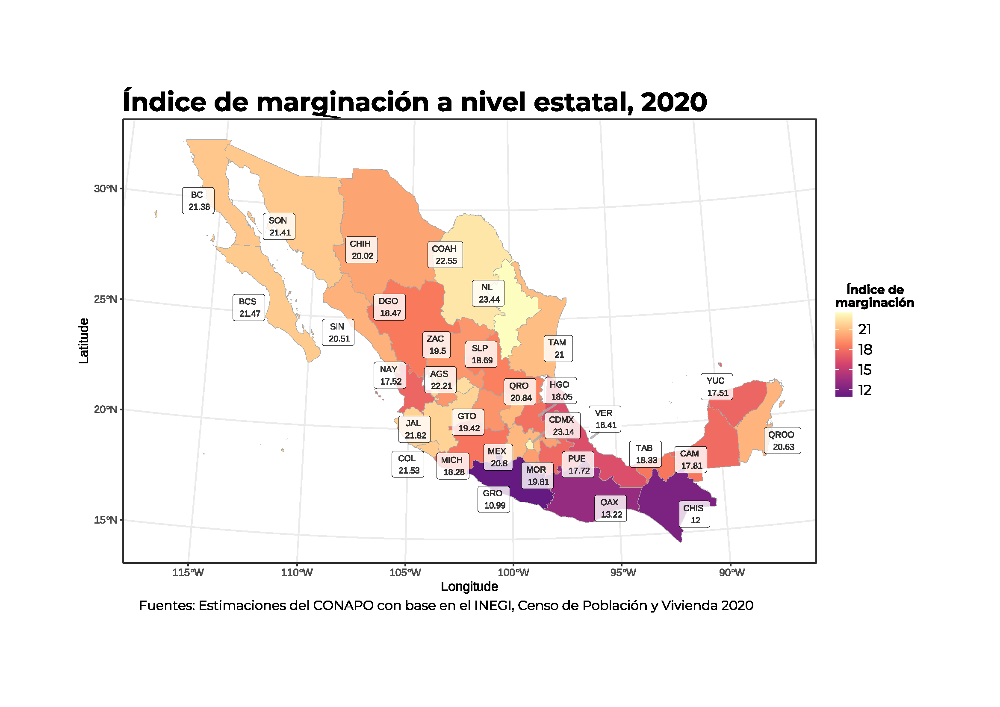
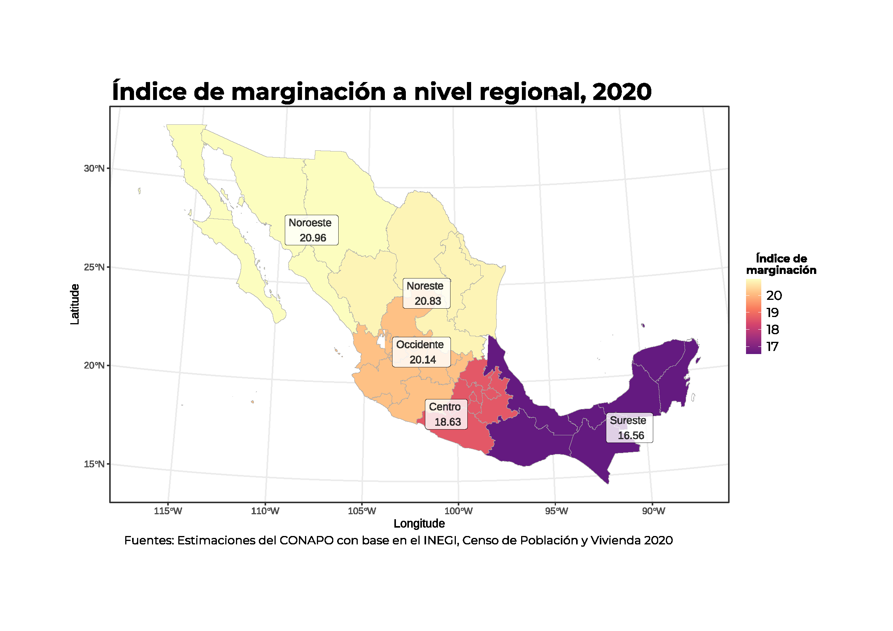

```{=html}
<style type="text/css">
body {
text-align: justify;
font-style: normal;
font-family: "Montserrat";
font-size: 12px
}
h1.title {
  font-size: 40px;
  color: #000D3B;
}
h1 {
  color: #B6854D;
}
h2 {
  color: #172984;
}
h3 {
  color: #172984;
}
h4 {
  color: #172984;
}
</style>
```

```{=html}
<style>
.nav>li>a {
    position: relative;
    display: block;
    padding: 10px 15px;
    color: #1C3BA4
}
.nav-pills>li.active>a, .nav-pills>li.active>a:hover, .nav-pills>li>a:focus {
    color: #ffffff;
    background-color: #09C2BC
}
</style>
```

```{=html}
<style>
.tile1-text {
    position: relative;
    display: block;
    padding: 10px 15px;
    color: #0A6A87;
    list-style: none;
}
.top1-tiles a:nth-of-type(1):hover, .top-tiles1 a:nth-of-type(1):focus{
    color: #ffffff;
    background: #0A6A87
}
</style>
```

```{=html}
<style>
.tile2-text {
    position: relative;
    display: block;
    padding: 10px 15px;
    color: #0A6CC8;
    list-style: none;
}
.top2-tiles a:nth-of-type(1):hover, .top2-tiles a:nth-of-type(1):focus{
    color: #ffffff;
    background: #0A6CC8
}
</style>
```

```{=html}
<style>
.math {
  font-size: 11px;
  color: #20218a;
}
</style>
```


```{r setup, include=FALSE}
knitr::opts_chunk$set(echo = TRUE, message = FALSE, warning = FALSE, cache = TRUE, 
                      cache.lazy = FALSE, class.source = "fold-show")
knitr::opts_knit$set(root.dir = here::here())
setwd(here::here())
```

```{r,echo=FALSE, eval=FALSE}
rm(list = ls())
```

```{r, echo = FALSE, results=FALSE}
# Paquetes que se usaron en el documento 
require(dplyr)          #A Grammar of Data Manipulation 
require(ggplot2)        # Generar gráficos ggplot y la geometría de un mapa
require(RColorBrewer)
require(ggspatial)
require(ggpubr)
require(knitr)
require(kableExtra)
require(openxlsx)
require(readxl)
require(rgdal)          #Para importar shapefiles. 
require(sp)             # Classes and Methos for Spatial Data
library(spdep)    # Índice de Moran 
require(spdplyr)        #Data manipulation verbs for the sptial classes
require(tidyverse) 
require(unikn)          # Paleta de colores
require(ggrepel)
require(viridisLite)

```


```{r, echo = FALSE, results=FALSE}
# Se descargan las fuentes de la google fonts
require(showtext)
# activar showtext
showtext_auto()
font_add_google("Montserrat", "montserrat")
```

## Objetivo  

El método DP2 se distingue por su propiedad de cardinalidad, que permite realizar análisis cuantitativos precisos y significativos entre diferentes valores del índice. Esta característica es fundamental ya que facilita no solo la comparación directa entre distintas unidades geográficas manteniendo su interpretación, sino que también permite realizar operaciones de agregación como sumas y promedios ponderados. A diferencia de otros métodos como los índices ordinales o el Análisis de Componentes Principales (`ACP`), el `DP2` mantiene la distancia relativa entre unidades, lo que resulta especialmente útil para calcular índices regionales mediante promedios ponderados sin perder su significado interpretativo. 

## Índice de Marginación    

El índice de marginación es una herramienta estadística fundamental para comprender y abordar las desigualdades sociales y económicas en un territorio determinado. Este índice proporciona una medida cuantitativa del grado en que una población o área geográfica se encuentra excluida del acceso a bienes y servicios esenciales para el desarrollo humano.

**¿Qué mide el índice de marginación?**
  
El índice de marginación no se limita a medir la pobreza económica, sino que abarca un espectro más amplio de dimensiones que incluyen:
  
* **Educación:** Nivel de alfabetización, acceso a la educación básica y superior.
* **Vivienda:** Condiciones de la vivienda, acceso a servicios básicos como agua potable y saneamiento.
* **Ingresos:** Nivel de ingresos y distribución de la riqueza.
* **Distribución de la población:** grado de urbanización y acceso a servicios de salud.


**Importancia del índice de marginación**
  
* **Identificación de áreas prioritarias:** Permite identificar las regiones y comunidades que requieren mayor atención y recursos para superar las condiciones de marginación.
* **Diseño de políticas públicas:** Facilita la formulación de políticas y programas específicos para reducir las desigualdades y promover el desarrollo inclusivo.
* **Monitoreo y evaluación:** Permite evaluar el impacto de las intervenciones y medir el progreso en la reducción de la marginación a lo largo del tiempo.
* **Concientización:** El índice de marginación ayuda a visibilizar las disparidades existentes y a generar conciencia sobre la necesidad de acciones para promover la equidad social.

**Metodología**
  
La construcción del índice de marginación implica la selección de indicadores relevantes, la ponderación de cada dimensión y la aplicación de técnicas estadísticas para obtener una medida sintética. El método de Distancia de Pena Trapero (DP2) es uno de los métodos utilizados para realizar este tipo de calculos.


### Método de Distancias Ponderadas ($DP_2$) 


El **Método de Distancia DP2** de **José Bernardo Peña Trapero (1977)** es una herramienta poderosa para construir **índices sintéticos de marginación, pobreza o desarrollo**. Su fortaleza radica en la **ponderación objetiva de variables** y la **reducción de redundancia** mediante \( R^2 \), lo que lo hace más robusto que otros métodos como el Análisis de Componentes Principales (ACP).
   

**Definición**

Sean:   

$\:\:\circ\:r$, el número de entidades o municipios;  
$\:\:\circ\:n$, el número de variables;  
$\:\:\circ\:x_{ij}$, el valor de la variable j en la entidad o municipio$i$;  
$\:\:\circ\:\sigma_{j}$, La Desviación Típica de la variable $j$;   
$\:\:\circ\:R^{2}_{i,i-1,...,1}$ el Coeficiente de Determinación en la Regresión de $X_{i}$ sobre $X_{i-1},X_{i-2},...,X_{1}$. 

Se define la $Distancia-P_{2}$ de la forma:    

\begin{align}
DP_{2}=\sum^{n}_{i=1}\frac{d_{i}}{\sigma_{i}}(1-R^{2}_{i,i-1,...,1})\:\:;\;\;con \:\:R^{2}_{1}=0
\end{align}

Donde:     

- \( DP_{2} \) es el índice para la unidad analizada.   
- \( d_i \) es la distancia entre el valor observado de la variable \( i \) y su referencia óptima (máximo o mínimo según la naturaleza de la variable):  
  
  \[
    d_i = X_i - X_i^*
      \]

donde \( X_i \) es el valor observado y \( X_i^* \) es el óptimo.  
- \( \sigma_i \) es la desviación estándar de la variable \( i \), utilizada para normalizar las diferencias.  
- \( R^2_{i, i-1, ..., 1} \) es el coeficiente de determinación de la regresión de la variable \( i \) sobre las variables anteriores (\( i-1, i-2, ..., 1 \)), lo que mide su redundancia.  
- \( R^2_1 = 0 \) por definición, ya que la primera variable no tiene otras previas con las cuales pueda estar correlacionada.  


El $DP_{2}$ cumple con las siguientes propiedades: no negatividad, homogeneidad, conmutatividad, desigualdad triangular, existencia y determinación, monotonía, unicidad, transitividad, no duplicidad de información, invariancia al cambio de origen y/o de escala en las unidades y exhaustividad.      

#### Ventajas del Método $DP_2$

- Elimina la necesidad de normalización previa.  
- Pondera las variables en función de su dispersión y redundancia.  
- Evita el sesgo por multicolinealidad** al reducir el peso de variables correlacionadas.  
- No requiere suponer normalidad de los datos.   

### Propiedad de la Cardinalidad 

La **propiedad de cardinalidad** implica que el índice **preserva relaciones de magnitud y permite comparaciones aritméticas**, es decir:    

  - **Diferencias entre valores de DP2 tienen significado**: Si un estado tiene \( DP_{2i} = 1.5 \) y otro \( DP_{2j} = 0.8 \), podemos decir que el primero tiene mayor marginación que el segundo.  
- **Permite operaciones de agregación** como sumas, promedios ponderados, etc.  
- **Se puede comparar directamente entre unidades geográficas** (municipios, estados, regiones) sin pérdida de interpretación.  
- Si el índice $DP_2$ fuera simplemente **ordinal** (como un ranking o una clasificación cualitativa), **no se podría promediar ni sumar** los valores estatales para obtener un valor regional.  

**Índice sintéticos ordinales** 

Otros índices sintéticos, como los construidos mediante **Análisis de Componentes Principales (ACP)** o escalas cualitativas, **no necesariamente tienen cardinalidad**. Por ejemplo:  
  - **Índices ordinales** solo indican un orden, pero no diferencias cuantitativas entre niveles (ejemplo: "baja", "media", "alta" marginación).  
- **ACP puede generar índices normalizados sin interpretación directa**, lo que dificulta operaciones de agregación.  

En cambio, **DP2 conserva la distancia relativa entre unidades**, permitiendo calcular un índice regional mediante un **promedio ponderado** sin perder significado.  


### Nivel Regional 

Si agrupamos los estados en **\( k \) regiones** (por ejemplo, \( k = 5 \)), una forma adecuada de calcular el índice DP2 regional es:

 \[
    DP_{2r} = \frac{\sum_{i \in R} DP_{2i}}{N_r}
    \]
    
donde:  
- \( DP_{2r} \) es el índice DP2 de la **región \( r \)**.  
- \( DP_{2i} \) es el índice DP2 del **estado o municipio \( i \) dentro de la región \( r \)**.  
- \( w_i \) es el **peso** del estado \( i \) en la región \( r \) (por ejemplo, la población del estado o su PIB).  
- \( N_r \) es el número de estados en la región \( r \).   

```{r, echo = FALSE}
tabla <- read.xlsx(paste0(here::here(), "/Bases/Regiones.xlsx")) %>% 
          mutate(across(everything(), ~replace_na(.x, "")))

tabla %>%
 kable(align = "c",
       caption = c("Tabla: Regiones del México.")) %>%
  kable_styling(position = "center",
                 bootstrap_options = c("condensed", "responsive", "bordered", "hover"),
                 font_size = 10) %>%
   kable_classic(full_width = F, html_font = "Montserrat") %>%
   collapse_rows(columns = 1, valign = "middle") %>%
    row_spec(0, color = "#031a3f",background = "#09C2BC", bold = TRUE) %>%
     gsub("font-size: initial !important;", "font-size: 9pt !important;", .) %>%
      gsub("text-align: initial !important;", "text-align: justify !important;", .)
```


### Bases de datos   


#### Nivel estatal

```{r}
tablas <- c("2010", "2015", "2020") 

for(i in 1:3){
  assign(paste0("IME_", tablas[i]), read.xlsx(paste0(here::here(), "/Bases/IME_2010-2020.xlsx"), sheet = paste0("IME_", tablas[i])) %>% 
                         filter(NOM_ENT != "Nacional") %>% 
                          mutate(across(c(4:12, 13, 15), as.numeric))) # Convierte las columnas seleccionadas en numéricas
}
```


<div style="height:700px;overflow:auto;">
```{r, echo = FALSE}
require(gt)

IME_2020 %>% 
 gt() %>%
  tab_header(title = "Indicadores sociodemográficos del índice de marginación, 2020",
             subtitle = "Nivel estatal") %>%
   tab_footnote(footnote = "Fuente: Estimaciones del CONAPO") %>%
    fmt_number(columns = names(IME_2020)[4:12], 
               decimals = 2) %>%
     fmt_number(columns = names(IME_2020)[c(13, 15)], 
                decimals = 3) %>%
      fmt_integer(columns = "POB_TOT", 
                   sep_mark = " ") %>%
       tab_options(heading.title.font.size = 14, 
                   heading.subtitle.font.size = 12,
                   table.font.names = "Century Gothic",
                   table.font.size = 10,
                   data_row.padding = px(1)) %>%
        tab_style(style = list(cell_text(align = "left",
                                         weight = 'bold')),
                  locations = list(cells_title(groups = c("title")))) %>%
         tab_style(style = list(cell_text(align = "left")),
                   locations = list(cells_title(groups = c("subtitle")))) %>%
          cols_label(CVE_ENT = md("**CVE_ENT**"),
                     NOM_ENT = md("**NOM_ENT**"), 
                     POB_TOT = md("**POB_TOT**"), 
                     ANALF = md("**ANALF**"),
                     SBASC = md("**SBASC**"),
                     OVSDE = md("**OVSDE**"),
                     OVSEE = md("**OVSEE**"),
                     OVSAE = md("**OVSAE**"),
                     VHAC = md("**VHAC**"),
                     OVPT= md("**OVPT**"),
                     PL.5000 = md("**PL.5000**"),
                     PO2SM = md("**PO2SM**"),
                     IM_2020 = md("**IM_2020**"),
                     GM_2020 = md("**GM_2020**"),
                     IMN_2020 = md("**IMN_2020**"),
                     LUGAR = md("**LUGAR**"))  %>% 
           cols_width(starts_with("NOM_ENT") ~ px(200),
                      everything() ~ px(100)) %>%
            as_raw_html() 
```
</div>


**Agrupación por regiones**  

Se clasifican las regiones por estados. Se itera sobre un conjunto de tres tablas almacenadas en una lista (tablas), que contiene los años de los diferentes índice de marginación. Dado que todas las bases de datos tienen la misma estructura y dimensión se genera un loop que permite clasificar a los estados en la variable `Regiones` y `IM_Region`.  

- `Region`: Se crea con base en la columna `CVE_ENT`, que contiene códigos de entidades federativas (estados de México).  

- `IM_Region`: Contiene el promedio de la columna del índice de marginación, agrupado por la nueva variable `Region`.

```{r}
for(i in 1:3){
  assign(paste0("IME_", tablas[i]), get(paste0("IME_", tablas[i])) %>% 
                                     mutate(Region = case_when(CVE_ENT %in% c("09", "12", "13", "15", "17", "21", "29") ~ "Centro",
                                                               CVE_ENT %in% c("05", "10", "19", "24", "28") ~ "Noreste",
                                                               CVE_ENT %in% c("02", "03", "08", "25", "26") ~ "Noroeste",
                                                               CVE_ENT %in% c("01", "06", "11", "14", "16", "18", "22", "32") ~ "Occidente",
                                                               CVE_ENT %in% c("04", "07", "20", "23", "27", "30", "31") ~ "Sureste")) %>% 
                                      mutate(IM_Region = ave(pull(., 13), Region, FUN = mean)))
}
```


### Shapefile

La función `readOGR` del paquete `rgdal`, extrae automáticamente la información utilizada por otros paquetes `SIG` de código abierto como QGIS y permite a R manejar una gama más amplia de formatos de datos espaciales. Esta función lee datos `OGR` y datos vectoriales, pero solamente permite manejar capas con características geométricas (no mezcla puntos, líneas o polígonos en una sola capa) y a su vez establecerá un sistema de referencia espacial si la capa tiene dichos metadatos.\
Para leer un archivo `shapefile`, se establecen los siguientes argumentos, como `dsn`, en donde se indica el directorio que contiene los shapes y `layer` que es el nombre explícito de la capa a trabajar y dichas capas deben de ir sin la extensión `.shp`.

A continuación, se lee el archivo .shp que contiene de manera integrada la división del área geoestadística estatal `agee`. 


**Área geoestadística estatal `agee`**   

```{r,results=FALSE,class.source = "fold-show"}
shape_estados <- readOGR(dsn ="D:/MGN/MGN 2020/MGN 2020/conjunto_de_datos", 
                             layer = "00ent",
                              encoding = "UTF-8",
                               use_iconv = TRUE)
```


#### SpatialPolygons

Se fusionan los datos del `shape_estados` con datos estadísticos del índice de marginación a nivel estatal (`IME_2020`), y el índice de marginación agrupado por regiones (`IM_Regiones`). El resultado es `layer_estados`, el cual es un objeto que contiene a los estados junto con sus atributos actualizados, lo que facilita su análisis y visualización en mapas.

#### $$SpatialPolygons \Rightarrow SpatialPolygons + Datos$$

```{r, class.source = "fold-show"}
layer_estados <- merge(shape_estados,
                        IME_2020 %>%
                          mutate(GM_2020 = fct_relevel(.$GM_2020, "Muy alto", "Alto", "Medio", "Bajo", "Muy bajo")),
                           by = "CVE_ENT")
```


### Índice de marginación a nivel estatal

```{r, fig.height=8, fig.width=10, eval = FALSE, class.source = "fold-hide"}
IME_2020 <- IME_2020 %>%  
             mutate(Entidad = case_when(NOM_ENT %in% "Aguascalientes" ~ "AGS",
                                        NOM_ENT %in% "Baja California" ~ "BC",
                                        NOM_ENT %in% "Baja California Sur" ~ "BCS",
                                        NOM_ENT %in% "Campeche" ~ "CAM",
                                        NOM_ENT %in% "Coahuila de Zaragoza" ~ "COAH",
                                        NOM_ENT %in% "Colima" ~ "COL",
                                        NOM_ENT %in% "Chiapas" ~ "CHIS",
                                        NOM_ENT %in% "Chihuahua" ~ "CHIH",
                                        NOM_ENT %in% "Ciudad de México" ~ "CDMX",
                                        NOM_ENT %in% "Durango" ~ "DGO",
                                        NOM_ENT %in% "Guanajuato" ~ "GTO",
                                        NOM_ENT %in% "Guerrero" ~ "GRO",
                                        NOM_ENT %in% "Hidalgo" ~ "HGO",
                                        NOM_ENT %in% "Jalisco" ~ "JAL",
                                        NOM_ENT %in% "México" ~ "MEX",
                                        NOM_ENT %in% "Michoacán de Ocampo" ~ "MICH",
                                        NOM_ENT %in% "Morelos" ~ "MOR",
                                        NOM_ENT %in% "Nayarit" ~ "NAY",
                                        NOM_ENT %in% "Nuevo León" ~ "NL",
                                        NOM_ENT %in% "Oaxaca" ~ "OAX",
                                        NOM_ENT %in% "Puebla" ~ "PUE",
                                        NOM_ENT %in% "Querétaro de Arteaga" ~ "QRO",
                                        NOM_ENT %in% "Quintana Roo" ~ "QROO",
                                        NOM_ENT %in% "San Luis Potosí" ~ "SLP",
                                        NOM_ENT %in% "Sinaloa" ~ "SIN",
                                        NOM_ENT %in% "Sonora" ~ "SON",
                                        NOM_ENT %in% "Tabasco" ~ "TAB",
                                        NOM_ENT %in% "Tamaulipas" ~ "TAM",
                                        NOM_ENT %in% "Tlaxcala" ~ "TLAX",
                                        NOM_ENT %in% "Veracruz de Ignacio de la Llave" ~ "VER",
                                        NOM_ENT %in% "Yucatán" ~ "YUC",
                                        NOM_ENT %in% "Zacatecas" ~ "ZAC"))

# "coordinates()" extrae los centroides de los polígonos, en el orden indicado en shape@data
centroids.df <- as.data.frame(coordinates(shape_estados)) %>%
                 rename("Longitude" = "V1","Latitude" = "V2") %>% 
                  cbind(IME_2020)

p <- ggplot() + 
      layer_spatial(layer_estados, aes(fill = IM_2020), 
                    color = "dark grey",
                    size = 0.5) + 
       geom_label_repel(data = centroids.df, 
                        aes(label = paste(Entidad, "\n", round(IM_2020, 2)),
                            x = Longitude,
                            y = Latitude), 
                        force = 0.6,
                        box.padding = 0.25,
                        min.segment.length = 0.5,
                        size = 2.5, 
                        fill = "transparent",
                        point.padding = 0.5,
                        segment.size = 0.7,
                        segment.colour= "dark grey",
                        label.size = 0,
                        alpha = 0.8) +
        theme_bw() + 
        theme(plot.title = element_text(size = 22, hjust = 0.15, family = "montserrat", face = "bold"),
              plot.caption = element_text(size = 11, hjust = 0.2, vjust = 1, family = "montserrat"), 
              legend.key.size = unit(0.5, "cm"),
              legend.text = element_text(size = 12, family = "montserrat"), 
              legend.title = element_text(size = 10, hjust = 0.5, family = "montserrat", face = "bold"),
              legend.position = "right"
               ) + 
         scale_fill_viridis_c(option = "A", begin = 0.3, end = 1) +
          scale_color_manual(values = viridis(32, option = "A", begin = 0.3, end = 1)) +
           guides(color = guide_legend(override.aes = list(fill = usecol(pal = pal_petrol, n = 5)))) +
            labs(title = "Índice de marginación a nivel estatal, 2020",
                 fill = stringr::str_wrap("Índice de marginación", 10), 
                 caption = expression(paste("Fuentes: Estimaciones del CONAPO con base en el INEGI, Censo de Población y Vivienda 2020")))
p
path = "Output/Mapa del IMM2020.pdf"
ggexport(p, filename = path ,width = 10, height = 10, device = "cairo")
```


{width="90%" fig-align="center"}

- El análisis del índice de marginación revela que las entidades con un **nivel muy alto** son Guerrero (10.9), Oaxaca (13.2) y Chiapas (11.9). Estas entidades comprenden una **población total de 13.2 millones de habitantes**, constituyendo el **10.4%** de la población mexicana, con un **promedio de 12.06 unidades** según el índice.

- Las entidades clasificadas con un índice de marginación con un **nivel alto** incluyen Campeche (17.8), Durango (18.4), Hidalgo (18.05), Michoacán (18.28), Nayarit (17.51), Puebla (17.72), Tabasco (18.3), Veracruz (16.4) y Yucatán (17.5). Esta categoría abarca **31.9 millones de habitantes**, representando el **24.7%** de la población nacional en 2020, con un **promedio de 17.78 unidades** en el índice.

- En contraste, las entidades que exhiben un índice de marginación de **nivel muy bajo** comprenden Aguascalientes (22.2), Coahuila (22.5), Ciudad de México (23.14) y Nuevo León (23.44). Este grupo engloba una **población de 19.5 millones de habitantes**, lo que constituye el **15.5%** de la población nacional, alcanzando un **promedio de 22.8 unidades en el índice**.

### Índice de marginación por región

```{r, fig.height=8, fig.width=10, eval = FALSE, class.source = "fold-hide"}
# "coordinates()" extrae los centroides de los polígonos, en el orden indicado en shape@data
centroids.df <- as.data.frame(coordinates(shape_estados)) %>%
                 rename("Longitude" = "V1","Latitude" = "V2") %>% 
                  cbind(IME_2020) %>% 
                   filter(NOM_ENT %in% c("Ciudad de México", "Nuevo León", "Chihuahua", "Jalisco", "Chiapas"))

p <- ggplot() + 
      layer_spatial(layer_estados, aes(fill = IM_Region), 
                     color = "dark grey",
                      size = 0.5) + 
       geom_label_repel(data = centroids.df, 
                        aes(label = paste(Region, "\n", round(IM_Region, 2)),
                            x = Longitude,
                            y = Latitude), 
                        force = 0.6,
                        box.padding = 0.25,
                        min.segment.length = 0.5,
                        size = 3.5, 
                        fill = "transparent",
                        point.padding = 0.5,
                        segment.size = 0.7,
                        segment.colour= "dark grey",
                        label.size = 0,
                        alpha = 0.8) +
        theme_bw() + 
          theme(plot.title = element_text(size = 22, hjust = 0.15, family = "montserrat", face = "bold"),
                plot.caption = element_text(size = 11, hjust = 0.2, vjust = 1, family = "montserrat"), 
                legend.key.size = unit(0.5, "cm"),
                legend.text = element_text(size = 12, family = "montserrat"), 
                legend.title = element_text(size = 10, hjust = 0.5, family = "montserrat", face = "bold"),
                legend.position = "right"
                 ) + 
           scale_fill_viridis_c(option = "A", begin = 0.3, end = 1) +
            scale_color_manual(values = viridis(32, option = "A", begin = 0.3, end = 1)) +
             guides(color = guide_legend(override.aes = list(fill = usecol(pal = pal_petrol, n = 5)))) +
              labs(title = "Índice de marginación a nivel regional, 2020",
                   fill = stringr::str_wrap("Índice de marginación", 10), 
                   caption = expression(paste("Fuentes: Estimaciones del CONAPO con base en el INEGI, Censo de Población y Vivienda 2020")))
p
path = "Output/Mapa del IMM2020 Región.pdf"
ggexport(p, filename = path, width = 10, height = 10, device = "cairo")
```


{width="90%" fig-align="center"}

- El análisis del índice de marginación regional indica que la **región Centro**, integrada por Hidalgo, Puebla, México, Morelos, Tlaxcala, Guerrero y Ciudad de México, concentra el **33.9% de la población nacional** con un índice promedio de **18.6 unidades**. Es notable destacar que Guerrero presenta el índice más bajo a nivel nacional con 10.9 unidades, mientras que la Ciudad de México, con 23.14 unidades, se posiciona como la segunda entidad con mejor nivel de bienestar en el país. 

- La **región Noreste**, constituida por Durango, Tamaulipas, San Luis Potosí, Coahuila y Nuevo León, alberga el **13.5% de la población nacional** (34.2 millones de habitantes) y registra un índice de **20.82 unidades**.

- La **región Noroeste**, compuesta por Baja California, Baja California Sur, Sonora, Chihuahua y Sinaloa, representa el **11.3% de la población nacional** (14.2 millones de habitantes) con un índice de **20.9 unidades**, posicionándose como la región con menor marginación.

- La **región Occidente**, que comprende Michoacán, Nayarit, Colima, Jalisco, Querétaro, Guanajuato, Zacatecas y Aguascalientes, concentra el **13.5% de la población nacional** (26.6 millones de habitantes) y mantiene un índice de **20.13 unidades**.

- La región Sureste, integrada por Campeche, Tabasco, Veracruz, Yucatán, Quintana Roo, Chiapas y Oaxaca, representa el 20.03% de la población nacional (25.2 millones de habitantes) y registra un índice de **16.5 unidades**.


## Referencias

Datos Abiertos de México - Índice de marginación (carencias poblacionales) por localidad, municipio y entidad. (2021). Retrieved February 13, 2022, from <https://datos.gob.mx/busca/dataset/indice-de-marginacion-carencias-poblacionales-por-localidad-municipio-y-entidad>


## Librerías

**Librerías que se usaron en el trabajo** 

```{r, collapse=FALSE}
sesion_info <- devtools::session_info()
```

```{r, echo = FALSE}
kable(dplyr::select(tibble::as_tibble(sesion_info$packages %>% dplyr::filter(attached == TRUE)),
                    c(package, loadedversion, source))) %>%
   kable_classic(full_width = TRUE, html_font = "montserrat", font_size = 10) 
```

<a rel="license" href="http://creativecommons.org/licenses/by/4.0/"></a><br />This work by [**Diana Villasana Ocampo**]{xmlns:cc="http://creativecommons.org/ns#" property="cc:attributionName"} is licensed under a <a rel="license" href="http://creativecommons.org/licenses/by/4.0/">Creative Commons Attribution 4.0 International License</a>.


