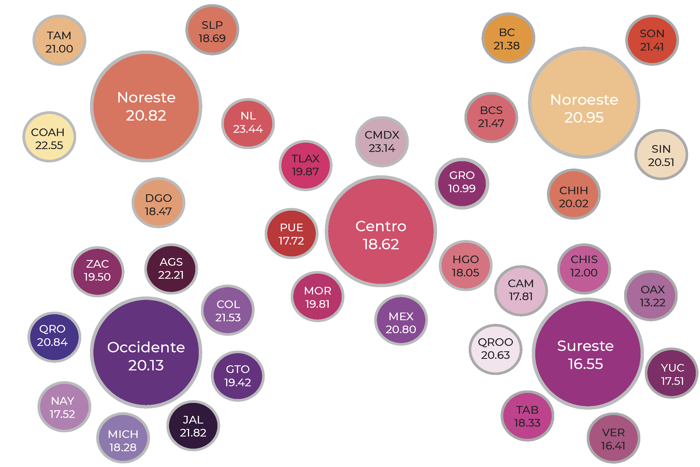

<!-- README.md is generated from README.Rmd. Please edit that file -->

```{r, include = FALSE}
knitr::opts_chunk$set(
  collapse = TRUE,
  comment = "#>"
)
```

# Índice de Marginación a Nivel Estatal con Agrupación Regional mediante el Método DP2

## 📌 Descripción  
Este repositorio presenta una alternativa al cálculo del **Índice de Marginación** a nivel estatal, agrupando los estados en **regiones** mediante el **Método de distancias ponderadas al cuadrado $DP_2$**. A diferencia de otros métodos, **DP2** permite la agregación y comparación directa de valores debido a su **propiedad de cardinalidad**, lo que lo hace ideal para análisis a nivel regional.  

{width="80%" fig-align="center"}

## 🎯 Objetivo  
El **Método DP2** garantiza que los valores del índice sean **comparables y agregables** sin perder su significado. Esto significa que se pueden calcular promedios regionales de marginación sin afectar la interpretación del índice, a diferencia de otros métodos como el **Análisis de Componentes Principales (ACP)**, que generan índices normalizados sin interpretación directa.  

## 📊 Índice de Marginación  
El **Índice de Marginación** mide las condiciones de desigualdad en diferentes territorios a partir de factores como:  

- **Educación** (alfabetización y acceso a educación básica).  
- **Vivienda** (infraestructura y acceso a servicios básicos).  
- **Ingresos** (niveles de pobreza y distribución económica).  
- **Urbanización** (distribución poblacional).  

## ⚙️ Metodología  
- Se utiliza el **Método DP2** para calcular un índice sintético de marginación para cada estado.  
- Gracias a su **propiedad de cardinalidad**, los valores estatales pueden **agruparse** por regiones sin perder su interpretación.  
- Se calculan promedios ponderados para obtener el índice de marginación a nivel **regional**.  

## 📂 Estructura del Repositorio    

```
/Bases       # Bases de datos utilizadas  
/R    # Código en R para el cálculo del índice  
/Output    # Resultados y visualizaciones  
README.md   # Descripción del proyecto  
```


